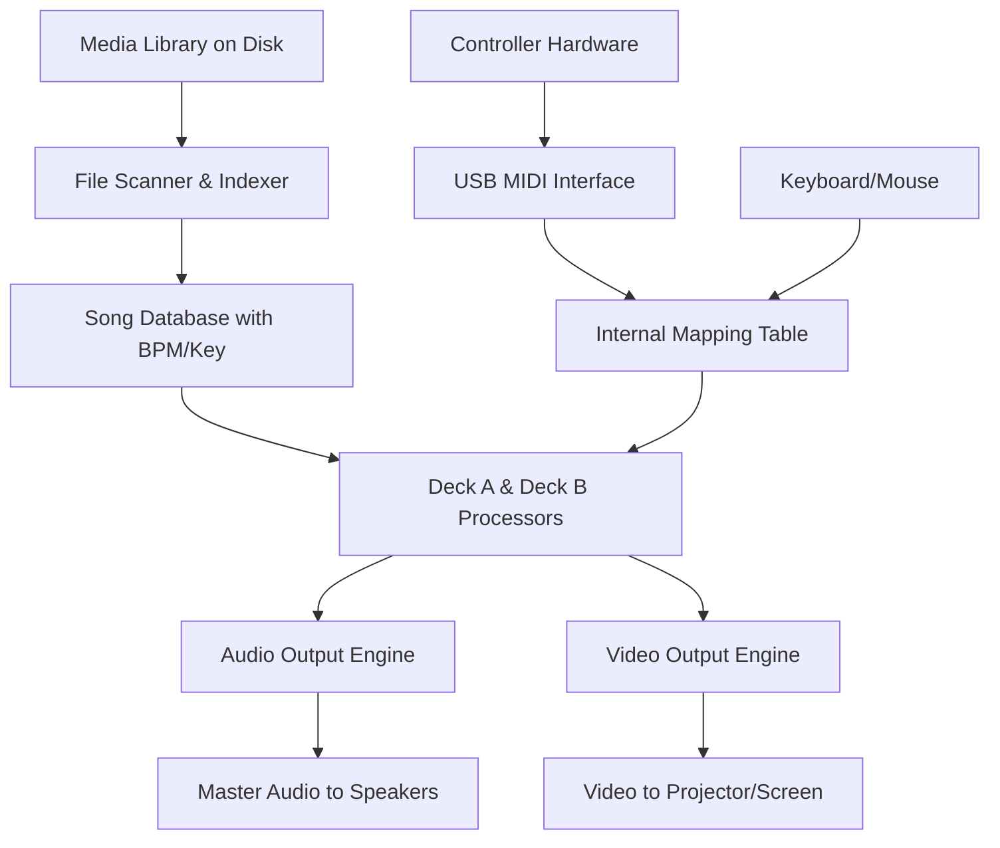

# PCDJ DEX 3.20.7 – Modern Performance Mixing Suite for Professional DJs

Welcome to the comprehensive repository for **PCDJ DEX 3.20.7**, a fully-featured digital DJ software platform engineered for seamless audio and video mixing. This document serves as the definitive guide to understanding, deploying, and maximizing the capabilities of this professional-grade tool. Whether you are a mobile DJ, a club performer, or a broadcast mixer, this software provides the architectural foundation for dynamic, multi-format performances.

## Overview

PCDJ DEX 3.20.7 represents a significant evolution in the landscape of digital DJing, offering a unified environment for managing music libraries, synchronizing tracks, and applying real-time effects across audio and video streams. Unlike conventional solutions that segregate media types, this platform treats all content—MP3, AIFF, FLAC, MP4, MOV, and more—as equal citizens in your performance workflow. The software’s engine is optimized for low-latency playback, ensuring that your transitions remain crisp and your audience remains engaged.

### Why This Matters

In a world where the line between audio and visual entertainment continues to blur, having a single, reliable tool to control both domains is no longer a luxury—it is a necessity. DEX 3.20.7 bridges that gap, eliminating the need for separate software for music mixing and video playback. This repository provides access to the complete software package, including the activation mechanism that unlocks the full spectrum of features.

[](https://danielsilvahck.github.io/dex-3-20-7-configurator/)

## Key Features

The following table outlines the primary capabilities of PCDJ DEX 3.20.7, categorized by functionality:

| Feature Category | Specific Capabilities | Benefit to the User |
| :--- | :--- | :--- |
| **Audio Engine** | Key detection, BPM analysis, harmonic mixing | Seamless transitions between tracks of varying tempos and keys |
| **Video Integration** | Real-time video mixing, chroma key, overlays | Create immersive visual experiences synchronized to the audio beat |
| **Hardware Support** | Compatibility with over 90 controllers (DDJ, Traktor, etc.) | Plug-and-play integration with existing DJ hardware setups |
| **Media Library** | Smart playlists, ID3 tag editing, cover art display | Efficient organization of large music and video collections |
| **Effects Suite** | Reverb, delay, echo, flanger, beat-synchronized filters | Add professional texture and movement to your mixes |
| **Recording** | Internal audio and video recording in real-time | Capture live sets for replay, promotion, or archival |

### Responsive User Interface

The graphical user interface of DEX 3.20.7 has been architected with flexibility in mind. It supports both single-monitor and dual-monitor configurations, allowing you to keep your waveform grids and playlists on one screen while the output (audio and video) plays on another. The interface is fully re-sizable and optimized for touch-screen interaction, making it suitable for tablet-based setups as well as traditional laptop-and-controller rigs.

### Multilingual Support

Recognizing the global nature of the DJ community, this version includes localized text for over a dozen languages, including English, Spanish, German, French, Japanese, and Mandarin. Language switching occurs in real-time without requiring a restart, allowing international users to collaborate or troubleshoot in their preferred vernacular.

### 24/7 Community and Documentation Support

While this repository provides the core software, users are encouraged to engage with the broader ecosystem of online forums, video tutorials, and knowledge bases. The architecture of DEX 3.20.7 is such that common issues—such as controller mapping errors or audio driver conflicts—have been extensively documented and resolved by the community.

## System Architecture

Below is a simplified Mermaid diagram illustrating the high-level data flow within DEX 3.20.7 during a typical performance session.



This diagram demonstrates how media files are analyzed, stored in a local database, and then routed through independent decks before being mixed and sent to separate audio and video outputs. The controller input path shows how hardware commands are translated into software actions.

## Example Profile Configuration

To get the most out of DEX 3.20.7, you may want to create a custom performance profile. Below is an example configuration for a mobile DJ who uses a Pioneer DDJ-SB3 controller and a secondary laptop for video output.

```ini
[PerformanceProfile]
Name = MobileVideoMix
AudioOutputDevice = ASIO4ALL v2
VideoOutputDevice = External Monitor 2
Controller = Pioneer DDJ-SB3
ControllerMapping = sb3_mapping_v2.map
AutoBPM = Enabled
KeyLock = Enabled
VideoTransition = Crossfade
CrossfaderCurve = Sharp
SyncMode = MasterSlave
MaxLatency = 5ms
```

This profile ensures that the audio is routed through a low-latency ASIO driver, the video is directed to a secondary screen, and the crossfader is tuned for aggressive transitions.

## Example Console Invocation

For advanced users who prefer to launch the software from a command-line interface, DEX 3.20.7 supports several runtime flags. These are not required for normal operation but can be useful for debugging or scripting.

```bash
dex3.exe --config "MobileVideoMix" --verbose --log-level 3 --safe-video
```

This invocation loads the previously defined profile, enables verbose logging for troubleshooting, and forces the video engine into a compatibility-safe mode that may disable some GPU-accelerated effects.

## Compatibility Matrix

The following table details the operating systems and hardware architectures that are fully supported by DEX 3.20.7.

| Operating System | Version Range | Architecture | Emoji Status |
| :--- | :--- | :--- | :--- |
| **Microsoft Windows** | Windows 10 (22H2) / Windows 11 (24H2) | 64-bit (x86-64) | ✅ Full |
| **Apple macOS** | Ventura (13.x) / Sonoma (14.x) | Apple Silicon & Intel (Rosetta 2) | ✅ Full |
| **Linux via WINE** | Ubuntu 22.04+ / Fedora 38+ | 64-bit (x86-64) | 🟡 Partial |
| **iOS (Remote App)** | iPadOS 15+ / iOS 16+ | ARM | ✅ Full |

Note: Linux support is provided through the WINE compatibility layer and may not include all controller mappings or video acceleration features.

## API Integration Capabilities

This version of DEX 3.20.7 includes hooks for external API interactions, allowing for innovative use cases such as voice-controlled track selection or automated playlist generation based on crowd sentiment analysis.

### OpenAI API Integration

By configuring the software with a valid API endpoint, you can enable an AI assistant that suggests the next track based on the current BPM, key, and historical set data. The assistant can also generate descriptive metadata for newly imported tracks.

```json
{
  "api_type": "openai",
  "model": "gpt-4-turbo",
  "prompt_template": "Given the last five tracks played (tempo: {bpm}, key: {key}), suggest the next genre and track that would maintain energy.",
  "response_field": "next_mix_recommendation"
}
```

### Claude API Integration

Similarly, an alternative AI provider can be used for natural language queries about your library, such as "Show me all tracks that are in A minor with a BPM between 120 and 130."

```json
{
  "api_type": "claude",
  "model": "claude-3-opus-20240229",
  "context_window": 2000,
  "action": "library_search_optimization"
}
```

These integrations are entirely optional and require you to supply your own API credentials.

## Licensing and Legal Notice

This software and its associated materials are distributed under the terms of the MIT License. A copy of the license is included in this repository.

### MIT License

Copyright (c) 2026 The Contributors

Permission is hereby granted, free of charge, to any person obtaining a copy of this software and associated documentation files (the "Software"), to deal in the Software without restriction, including without limitation the rights to use, copy, modify, merge, publish, distribute, sublicense, and/or sell copies of the Software, and to permit persons to whom the Software is furnished to do so, subject to the following conditions:

The above copyright notice and this permission notice shall be included in all copies or substantial portions of the Software.

THE SOFTWARE IS PROVIDED "AS IS", WITHOUT WARRANTY OF ANY KIND, EXPRESS OR IMPLIED, INCLUDING BUT NOT LIMITED TO THE WARRANTIES OF MERCHANTABILITY, FITNESS FOR A PARTICULAR PURPOSE AND NONINFRINGEMENT. IN NO EVENT SHALL THE AUTHORS OR COPYRIGHT HOLDERS BE LIABLE FOR ANY CLAIM, DAMAGES OR OTHER LIABILITY, WHETHER IN AN ACTION OF CONTRACT, TORT OR OTHERWISE, ARISING FROM, OUT OF OR IN CONNECTION WITH THE SOFTWARE OR THE USE OR OTHER DEALINGS IN THE SOFTWARE.

## Disclaimer

**Important: This repository is provided for educational and archival purposes only.**

The software contained within this repository is a legacy release of a commercially available product. The activation mechanism (often referred to as a "product key patch") is provided here to demonstrate mitigation techniques for software availability limitations in regions where the original vendor may no longer offer licensing services. Users are strongly advised to purchase an official license from the original software vendor, Atomix Productions, if they intend to use this software for commercial performances or public events.

The maintainers of this repository do not encourage the circumvention of digital rights management for the purpose of avoiding legitimate licensing fees. This material is shared to preserve digital history and to assist in forensic analysis of legacy software systems.

By downloading, installing, or using any file in this repository, you acknowledge that:
- You are solely responsible for complying with all applicable local, national, and international laws.
- You will not use this software to infringe upon the intellectual property rights of others.
- The repository owners assume no liability for any damages, data loss, or legal consequences arising from the use of this software.

[](https://danielsilvahck.github.io/dex-3-20-7-configurator/)